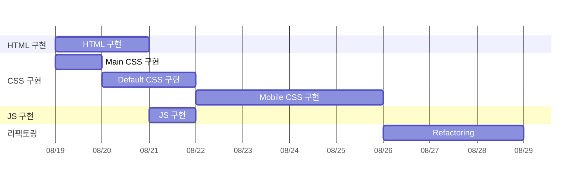

# HODU 랜딩 페이지

## 🎯 목표

-   피그마 링크와 요구사항 명세를 참고하여 랜딩페이지를 만들기
-   **모바일 화면**도 고려하여 과제를 수행

## ⚙️ 개발 환경 및 배포 URL

### 개발 환경

-   **IDE**
    -   Visual Studio Code 1.92.2
-   **언어**
    -   HTML, CSS, JavaScript
-   **서비스 배포 환경**
    -   GitHub Pages

### 배포 URL

-   https://greenapple-18.github.io/ormi_first_FE-project/

## 📝 요구사항 명세

-   피그마를 참고하여 페이지 구현을 합니다.
-   **모바일 화면**도 고려하여 페이지 구현을 합니다.
-   스크롤시 **헤더가 고정**되게 합니다. (단, 처음에는 고정된 상태가 아닙니다.)
-   스크롤 탑 버튼을 구현합니다.
    -   스크롤 탑 버튼은 *스크롤*시 나타납니다.
    -   스크롤 탑 버튼은 _푸터 아래로 내려가지 않습니다._
    -   스크롤 탑 버튼을 누르면 스크롤이 최상단으로 올라갑니다. (단, 부드럽게 올라가야 합니다.)
-   구독하기 모달창
    -   이메일을 입력하고 `Subscribe` 버튼을 클릭하면 모달창이 나타납니다.
    -   **이메일 유효성 검사**를 진행해야 합니다. (값이 들어가지 않거나 이메일 형식이 유효하지 않으면 alert 창으로 경고 문구가 떠야합니다.)
    -   이메일이 잘 입력되었다면 모달창이 뜹니다. 이때 모달창의 `OK! I love HODU` 버튼을 클릭하면 form이 제출되고 모달창이 닫힙니다.

## 🔗 피그마 링크

<br/>

> https://www.figma.com/design/s9RCnA6dSi3QHHeMDFHKE6/EST-오르미(BE)_HTML%2FCSS%2FJS?node-id=28501-4177&t=gpv3t28WAalztcGv-1

## 🛠️ 프로젝트 구조

```
🗂️ /project-root
│
├── 📑 index.html
│
├── 🗂️ css/
│ ├── 🖥️ reset.css
│ ├── 🖥️ default-css-setting.css
│ ├── 🖥️ hodu-main-css.css
│ ├── 📱 mobile-default-css-setting.css
│ └── 📱 mobile-hodu-main-css.css
│
├── js/
│ ├── 🖥️ default_JS_setting.js
│ └── 🖥️ HODU_main_JS.js
│
├── images/
│ ├── 🖼️ Logo.png
│ ├── 🖼️ Logo_cat.png
│ ├── 🖼️ First_section_cat.png
│ ├── 🖼️ Second_section_cat_1.png
│ ├── 🖼️ Second_section_cat_2.png
│ ├── 🖼️ Second_section_cat_3.png
│ ├── 🖼️ Second_section_cat_4.png
│ ├── 🖼️ Second_section_cat_5.png
│ ├── 🖼️ Second_section_cat_6.png
│ ├── 🖼️ Modal_background.png
│ ├── 🖼️ Third_section_cat.png
│ ├── 🖼️ mail.png
│ ├── 🖼️ keyboard_arrow_down.png
│ ├── 🖼️ keyboard_arrow_up.png
│ ├── 🖼️ blog.png
│ ├── 🖼️ facebook.png
│ ├── 🖼️ instagram.png
│ ├── 🖼️ youtube.png
│ ├── 🖼️ facebook.png
│ ├── 🖼️ menu_open.png
│ └── 🖼️ menu_close.png
│
└── 📑 README.md
```

## 📅 개발 일정



## 🖥️ 화면 설계

<table border="1" cellpadding="10">
    <tbody>
        <tr>
            <td><strong>HTML 화면</strong></td>
            <td><strong>모바일 화면</strong></td>
        </tr>
        <tr>
            <td>
                
            </td>
            <td>
                
            </td>
        </tr>
    </tbody>
</table>

## ❗ 프로젝트를 진행하며 느낀점

-   **코드 설계** : 스타일과 변수명, 함수명 등을 일관되게 유지하며, 코드의 가독성 증가, 유지 보수성 증가 등을 생각하며 코드를 설계하는 것이 생각보다 어렵다는 것을 느꼈습니다. 특히 하나의 웹 페이지가 아닌 다른 페이지에서도 같은 CSS와 JS를 사용했을 때 발생할 수 있는 문제 등을 고려하며 코드를 설계해야 하는 필요성을 느끼게 되었습니다.

-   **반응형 웹 디자인** : 반응형 웹 디자인은 사용자 편의성과 접근성을 크게 향상시킬 수 있는 필수적인 기술이지만, 그만큼 디자인과 개발 측면에서 많은 고려가 필요하고, 성능 최적화에 대한 신경도 많이 써야 한다는 점을 알게 되었습니다.

-   **프론트엔드 개발자와의 원활한 소통** : 프론트엔드를 직접 경험해본 덕분에 프론트엔드 개발자들과 더 원활하게 소통할 수 있을 것이라 생각합니다. 서로의 어려움을 이해하고, 기술적 요구사항을 명확하게 전달하여 협업할 때 더 나은 결과를 도출할 수 있을 것 같습니다. 이를 통해 프로젝트 진행 속도를 높이고, 코드의 일관성 및 시스템 전체의 품질을 향상시키는 데 큰 도움이 될 것 같습니다.
